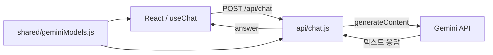

# Cloud Chat Bot

[웹 데모](https://cloud-chat-bot.vercel.app/)

Gemini 모델을 선택해 대화하는 React 챗봇. 같은 채팅 핸들러를 로컬 Vite 서버와 Vercel 함수에서 사용한다.

## 대화가 처리되는 방식

홈에서 모델을 고른 뒤 채팅 화면으로 이동한다. `useChat`이 대화 목록과 전송 상태를 관리하고, 지금까지의 메시지를 `/api/chat`에 보낸다. 서버는 assistant 역할을 Gemini의 `model` 역할로 바꿔 `generateContent`를 호출한다. API 키는 서버의 환경변수에서 읽는다.

- 모델 선택 목록과 서버 허용 목록은 `shared/geminiModels.js`를 공유한다.
- Enter로 전송하고 Shift+Enter로 줄을 바꾼다. 요청 중에는 중복 전송을 막는다.
- RESET으로 대화를 초기화한다. 대화는 React 메모리에만 남고 새로고침하면 사라진다.
- Glass UI는 CSS 레이어와 SVG displacement filter로 구성한다.



로컬에서는 `vite.config.js`의 `local-api` 미들웨어가 핸들러를 호출한다. Vercel에서는 `api/chat.js`가 서버리스 함수가 된다. 응답은 한 번에 받으며 SSE나 WebSocket 스트리밍은 구현하지 않았다.

## 기술과 파일

| 역할 | 기술 / 위치 |
|---|---|
| 화면 | React 19, lucide-react, `src/pages/`, `src/components/` |
| 대화 상태 | React hook, `src/hooks/useChat.js` |
| 개발·빌드 | Vite 7, `vite.config.js` |
| 모델 호출 | Node.js fetch, `api/chat.js` |
| 공용 모델 설정 | `shared/geminiModels.js` |
| 배포 설정 | Vercel rewrite, `vercel.json` |

`public/`의 이미지는 정적 리소스다. `dist/`는 빌드 산출물이며 소스는 `src/`, `api/`, `shared/`에서 관리한다.

## 로컬 실행

Node.js 22.12 이상과 npm을 사용한다. Vite 7의 Node engine 범위는 lockfile에서도 확인할 수 있다.

```bash
npm ci
cp .env.example .env
npm run dev -- --host 127.0.0.1
```

`.env`의 `GEMINI_API_KEY`를 설정하고 터미널에 출력된 주소로 접속한다. 기본 포트는 5173이며 사용 중이면 다른 포트가 선택된다.

| 환경변수 | 의미 |
|---|---|
| `GEMINI_API_KEY` | 서버에서 Gemini를 호출하는 키, 필수 |
| `GEMINI_DEFAULT_MODEL` | 요청에 model이 없을 때 사용할 모델. 공용 허용 목록에 있어야 한다 |

모델 ID는 코드의 허용 목록을 뜻한다. Google 계정에서 실제 호출 가능한지는 별도로 확인해야 한다.

```bash
npm run lint
npm run build
```

`npm run preview`는 정적 빌드 확인용이다. `configureServer`에서 등록한 로컬 API는 preview에 등록되지 않으므로 전체 채팅 확인에는 `npm run dev` 또는 Vercel 함수 환경이 필요하다.

## API

`POST /api/chat`, JSON 요청. 별도의 사용자 인증은 없다.

```json
{
  "model": "gemini-3.1-flash-lite",
  "messages": [{"role": "user", "content": "안녕"}]
}
```

| 응답 | 내용 |
|---|---|
| 200 | `{"answer":"응답 텍스트"}` |
| 400 | 허용되지 않은 모델 또는 빈 메시지 |
| 405 | POST 외 메서드, `Allow: POST` |
| 500 | API 키 미설정 |
| 502 | Gemini의 빈 답변 |
| 503 | 외부 API 연결 실패 |

오류 본문은 `error`, `statusCode`를 포함하고 Gemini 오류 상태도 전달한다. `messages`는 배열이며 각 `content`는 문자열이어야 한다. 임의 타입을 검증하는 완전한 request schema, 사용자별 rate limit, 영구 저장은 현재 없다.
